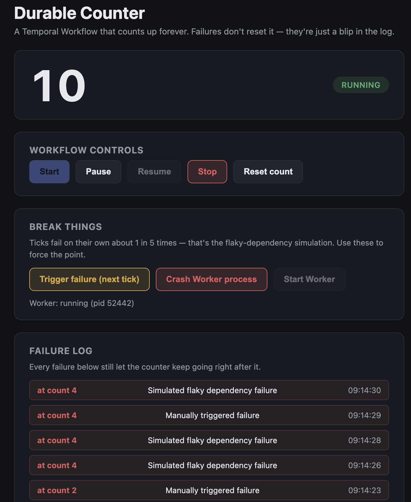

# counter-workflow

A Temporal Workflow that counts up, roughly once a second, for as long as you leave it
running — plus a tiny HTML page to watch it do that. This is the simplest possible demo of
**durable execution**: the counter never resets and never gets stuck, no matter how many
things fail around it.

```
1, 2, 3, FAILURE, 4, 5, 6, FAILURE, 7, 8, ...
```

[]

## The idea

- `counterWorkflow` loops: call the `tick` Activity, increment `count` if it succeeded,
  sleep a second, repeat. Each attempt is really ~250ms of simulated Activity work plus a
  1-second durable timer, so ticks land roughly 1.25 seconds apart, not exactly on the
  second — this is a demo, not a metronome.
- `tick` (in `activities.ts`) simulates a flaky dependency — it fails on its own about 1 in
  5 calls, and you can force it to fail on demand from the UI. A failed tick does **not**
  increment `count`.
- When `tick` fails, the Workflow does **not** crash and does **not** reset `count`. It logs
  the failure (visible in the "Failure log" panel, capped at the most recent 20) and moves
  on to the next tick.
- `count`, `status`, and the failure log are all Workflow state. Temporal durably persists
  every change to that state on the Server as it happens — this is what actually makes the
  demo interesting, not the `try`/`catch`. See "Try this" below.
- Kept intentionally simple: this Workflow runs forever without ever calling
  `continueAsNew`, so its History grows without bound. Fine for a short demo session; a
  long-lived version of this pattern would periodically continue-as-new to keep History
  small. Not implemented here on purpose — one less concept to explain.

## Project layout

- `src/workflows.ts` — `counterWorkflow`: the loop, its Signals (`pause`, `resume`, `stop`,
  `reset`, `failNow`), and its Query (`status`).
- `src/activities.ts` — `tick`: the one place that's allowed to be flaky/non-deterministic.
- `src/worker.ts` — connects to the Server, polls task queue `counter-tasks`.
- `src/client.ts` — optional CLI: starts the Workflow without the UI.
- `src/api.ts` — a small Express server that (1) serves `public/` (the UI), (2) is a
  Temporal **Client** — starts the Workflow, sends Signals, runs the Query — and (3) spawns
  and can kill/restart the Worker process, purely so the UI's "Crash Worker" button has a
  real process to kill.
- `public/` — the UI itself: `index.html`, `style.css`, and one vanilla-JS file
  (`app.js`, no framework) that polls `/api/status` once a second and renders it.

## Running it

You need a local Temporal Server (see the [repo README](../README.md#running-the-local-temporal-server)):

```bash
temporal server start-dev
```

Then, from this folder, in a second terminal:

```bash
npm install
npm run api
```

`npm run api` starts the Express/API server **and** spawns the Worker as a child process
for you. Open [http://localhost:3000](http://localhost:3000) and click **Start**.

Prefer to run the Worker yourself in its own terminal (matching the other examples in this
repo)? Set `SKIP_WORKER_SPAWN=1` and use `npm run worker.watch` instead:

```bash
SKIP_WORKER_SPAWN=1 npm run api    # terminal 2: API + UI, no auto-spawned Worker
npm run worker.watch               # terminal 3: the Worker, auto-restarts on save
```

In this mode the API knows it doesn't own the Worker: the UI shows "Worker: externally
managed" and disables the "Crash Worker" / "Start Worker" buttons (they'd otherwise spawn a
second, API-owned Worker competing with your manual one on the same task queue). Use
`Ctrl+C` / restart `worker.watch` yourself instead.

## Using the UI

- **Start / Pause / Resume / Stop / Reset count** — control the Workflow via Signals.
  Pausing suspends the Workflow with a durable `condition()` wait, not a polling loop.
- **Trigger failure (next tick)** — signals the Workflow to force the *next* `tick` to fail,
  so you don't have to wait on the ~20% natural failure rate.
- **Crash Worker process** — `SIGKILL`s the Worker process outright (only works when the API
  is managing it — see "Running it" above; the button is disabled under
  `SKIP_WORKER_SPAWN=1`). The count freezes (the UI shows "worker unreachable") because
  nothing is running your Workflow code — the Server is just holding durable state,
  waiting. The API respawns a new Worker process ~4 seconds later, and — because that new
  process still has to cold-start (`ts-node` + bundling the Workflow code takes a couple
  more seconds the first time) — it can be closer to 6-8 seconds in total before the count
  moves again. Either way, it resumes at the count it left off at.
  - You'll often see the count jump forward by more than one tick right after it resumes,
    sometimes several. That's expected: the Server keeps its own durable timers running
    the whole time the Worker is down, and if the Worker crashed mid-`tick`, that in-flight
    Activity attempt also has to hit its 10-second timeout and get logged as a failure
    before the loop can continue. Once a Worker reconnects, it works through whatever was
    already due — nothing is lost or double-counted, it just doesn't trickle back in one
    tick at a time.

## Try this

1. Click **Start**, watch it count for a bit, then click **Crash Worker process**.
2. Watch the badge change to "running (worker unreachable)" and the count freeze.
3. Wait ~4 seconds for the auto-restart, or open the Temporal Web UI
   ([http://localhost:8233](http://localhost:8233)) and watch the Workflow's pending task
   queue while the Worker is down.
4. Watch the count pick back up — same Workflow Execution, no restart, no lost ticks.

This is the whole point of Temporal: your process can die, and the thing it was doing
doesn't die with it.

## How this maps to Temporal Core Primitives

| Primitive | What it is | In this app |
|---|---|---|
| **Client** | SDK code in *your* process that talks to the Temporal Server. Starts Workflows, sends Signals, runs Queries. Does not execute Workflow or Activity code. | `src/api.ts` (the Express app behind the UI) makes every Client call the UI uses: **Start / Pause / Resume / Stop / Reset / Trigger failure**, plus the status **Query**. `src/client.ts` is a separate, optional CLI that only starts the Workflow — no UI needed. |
| **Workflow** | The orchestration — sequence of steps, written as code. Deterministic. No HTTP, no `Math.random()`, no wall-clock `setTimeout`. | `src/workflows.ts` → `counterWorkflow`. The loop: `tick`, maybe increment `count`, `sleep`, repeat. `count` / `status` / failure log live here. |
| **Activity** | One unit of work inside that orchestration. Side effects and flakiness live here. | `src/activities.ts` → `tick`. Pretend API call: ~250ms delay, ~20% random fail, or fail when `failNow` was signaled. |
| **Worker** | The process that runs *your* Workflow and Activity code. Polls a Task Queue. If it dies, the Server still has the state. | `src/worker.ts`. `npm run api` spawns it. **Crash Worker** `SIGKILL`s this process. |
| **Task Queue** | Named queue the Server puts work on; Workers pull from it (Workflow tasks, Activity tasks, Signals, Timers firing). | `counter-tasks` in `src/shared.ts`. Client, Worker, and Server must use the same name. |
| **Signal** | Async message to a *running* Workflow Execution. Changes its state (human-in-the-loop). | `pause` / `resume` / `stop` / `reset` / `failNow` in `workflows.ts`. UI buttons → API → `handle.signal(...)`. Each handler calls `log.info(...)`, so a click shows up in the Worker terminal and as a `WorkflowExecutionSignaled` event in the UI's Event History. |
| **Timer** | Durable delay. Survives Worker crashes. Not `setTimeout`. | `await sleep(tickIntervalMs)` between ticks — `tickIntervalMs` defaults to `1000` (1 second), passed in when the Workflow is started. While the Worker is down, the Server-side timer still counts down; after restart the Worker catches up. |
| **Temporal Server** | Stores history, owns Task Queues and Timers, retries, hands work to Workers. Never runs your TypeScript. | `temporal server start-dev` on `localhost:7233`. UI at [http://localhost:8233](http://localhost:8233), Workflow Id `counter-demo`. |

**How a tick flows**

1. **Client** (API) already started `counterWorkflow` with Workflow Id `counter-demo`.
2. **Server** puts a Workflow task on **Task Queue** `counter-tasks`.
3. **Worker** pulls it, runs the **Workflow** loop, which schedules the `tick` **Activity**.
4. **Server** queues that Activity; **Worker** runs `tick`. Success → `count++`. Failure → log it, don't increment.
5. **Workflow** starts a **Timer** (`tickIntervalMs`, 1 second by default), then loops.
6. A UI button is a **Signal**. The Server delivers it on the next Workflow task. Pause uses `condition()` (durable wait), not a polling loop.

The HTML page in `public/` is not a Temporal primitive. It talks to the API; the API is the Client.

